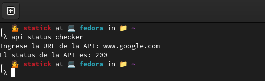

# Status Checker API



Un paquete para verificar el estado de una API.

## Instalación

```sh
pip install status_checker_api
```

# Uso


```sh
status-checker-api
```

Tendra que pasar los parámetros: de la url, por ejemplo **www.google.com** y el tiempo de espera en segundos, por ejemplo **5**.

